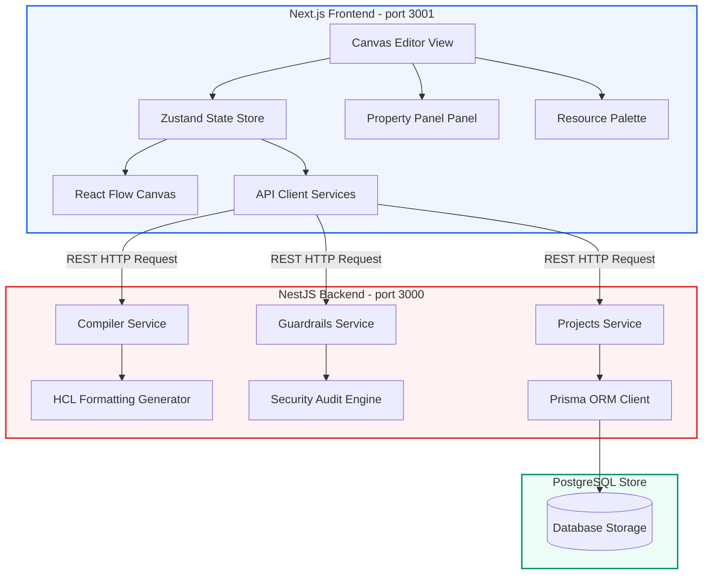

# CanvasCloud ☁️

CanvasCloud is a premium, visual drag-and-drop cloud architecture designer and Terraform HCL compiler. Built inside a pnpm monorepo using **NestJS** and **Next.js**, it enables developers to visually draft AWS topologies, validate security guardrails, preview compile results, and export deployable Terraform configurations.

---

## 🚀 Key Features

*   **Visual Drag-and-Drop Canvas**: Powered by React Flow v12, featuring coordinate translates, grid snapping, custom pastel node cards, and animated edges.
*   **22 Custom AWS Resources**: Grouped into 9 visual categories spanning Compute, Network, Databases, Serverless, Load Balancers, Security, and DNS.
*   **Dynamic Configurations Inspector**: Dynamic configurations forms rendered from type-safe parameter schemas supporting validation checking and error highlighting.
*   **HCL Compiler Pipeline**: Compiles visual topology canvas graphs into topological sorted, resolution-resolved, and formatted Terraform HCL code bundles.
*   **Security Guardrails Engine**: Audits canvas designs against security rules, displaying critical and warning severities alongside suggestions.
*   **Cloud Project Catalog**: Syncs architecture configurations to PostgreSQL database tables with loaders, deletes, and session overrides.

---

## 🏗️ System Architecture



---

## 📂 Project Structure

The workspace is organized as a unified monorepo:

```text
├── apps/
│   ├── api/                 # NestJS backend framework
│   │   ├── src/
│   │   │   ├── compiler/    # HCL generators, reference resolver, top-sorter
│   │   │   ├── guardrails/  # Rule auditors and scanners
│   │   │   └── projects/    # REST project persistence storage
│   └── web/                 # Next.js app router frontend UI
│       ├── src/
│       │   ├── components/  # Canvas Workspace, Property Panel, Modals
│       │   ├── constants/   # AWS metadata configurations and property schemas
│       │   ├── hooks/       # useResourcePalette, usePropertyPanel, useTopBar
│       │   └── store/       # Zustand store and validator mappings
├── packages/
│   └── shared/              # Shared types, type schemas, and topology matrices
├── ai-docs/
│   ├── PROJECT.md           # Master roadmap specifications
│   └── progress.md          # Session execution checklist
└── README.md                # Project documentation index
```

---

## 🛠️ Getting Started

### Prerequisites

*   **Node.js**: v18.0.0 or higher
*   **pnpm**: v9.0.0 or higher
*   **PostgreSQL**: A local or remote database instance running

### Installation

1. Clone the repository and navigate to the project directory:
   ```bash
   cd DEV-TOOL
   ```

2. Install dependencies for all workspace projects:
   ```bash
   pnpm install
   ```

3. Setup environment variables:
   *   Copy `.env.example` to `.env` at the root:
       ```bash
       cp .env.example .env
       ```
   *   Configure `DATABASE_URL` with your PostgreSQL credentials inside the `.env` file.

4. Execute database migrations and seed schemas:
   ```bash
   pnpm --filter @canvascloud/api prisma db push
   ```

5. Launch compile and run services in watch mode:
   ```bash
   pnpm dev
   ```
   *   **Frontend Client**: `http://localhost:3001`
   *   **Backend Server**: `http://localhost:3000`
   *   **Swagger API Docs**: `http://localhost:3000/api/docs`

---

## 🧪 Running Tests

To run the Jest unit and integration test suites:
```bash
pnpm test
```

---

## 📄 License

This project is proprietary and confidential. All rights reserved.
